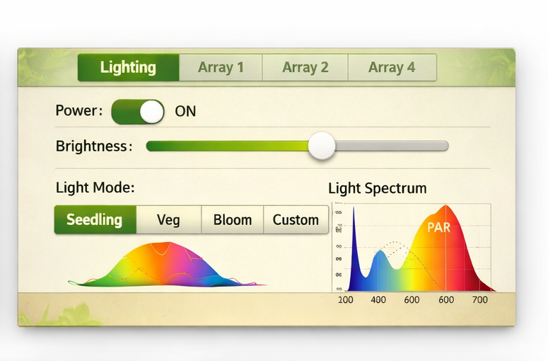

# GrowBox

**GrowBox** is a self-built indoor grow-tent environmental controller — a
single 7-inch touchscreen device that drives the lighting, monitors the
climate, and (soon) accepts voice commands so you can run the tent
hands-free while gardening.

This repository is the public project page. The firmware source is kept
private during development.

---

## What it does

- **Lighting** — drives 4 independent WS2815 LED arrays (30 × 6 panels each,
  fed from a single 12 V / 250 W supply). Per-array brightness, color
  presets, full-spectrum color picker, and grow/bloom schedules.
- **Climate** — 4 × AHT21 temperature/humidity probes (one per zone, via a
  TCA9548A I²C mux) plus a Sensirion SCD41 CO₂ sensor.
- **Soil** — 4 × capacitive soil-moisture probes through an ADS1115 ADC.
- **UI** — 1024 × 600 LVGL interface on the local screen, with a local
  web UI on the same Wi-Fi network for remote checks.
- **Voice control** *(in progress)* — on-device wake-word + command
  recognition using Espressif's esp-sr stack so that watering, light
  toggles, and brightness changes can be triggered hands-free.

## Hardware

| Function | Part |
|---|---|
| MCU + Display | Waveshare ESP32-P4-WIFI6-Touch-LCD-7B (7" 1024×600 capacitive touch) |
| Lights | 4 × WS2815 panels, 12 V / 250 W PSU |
| Temp/RH | 4 × AHT21 via TCA9548A I²C mux |
| CO₂ | Sensirion SCD41 |
| Soil moisture | 4 × capacitive probes via ADS1115 |
| Audio | On-board ES8311 codec, MEMS mic, 1.5 W speaker amp |

## Status

Active hobby project, in development. Hardware is built and the firmware
is running on-device; voice control is the current work item.

## License & use

Personal / non-commercial. The hardware design, name, and artwork are
the author's own work; nothing in this project is affiliated with any
third party.

## Contact

Open an issue on this repository for questions about the project.
